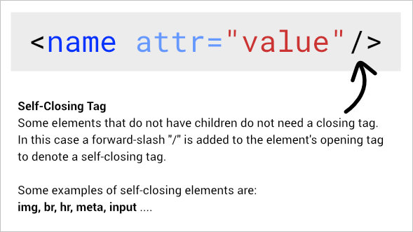

# HTML Cheatsheet
This is the cheatsheet for the basic syntax and terminologies of HTML.

Note: This is not an exhaustive list of all the elements HTML has. For an awesome [HTML Reference, click here.](https://developer.mozilla.org/en-US/docs/Web/HTML/Element)

## Basic Syntax
All languages have a syntax. English, Urdu, HTML, JavaScript all have a syntax. Here is the syntax of writing HTML...

But first one important info.

HTML is a markup language that has ONLY one thing - Elements. HTML is a collection of elements. A combination of elements are used to build a webpage.

**So here is the basic syntax of an HTML Element:**

### Self-Closing Element/Tag
Not all elements have children, in that case the opening tag can close itself - AKA *Self-Closing Element/Tag*. Here is how its done:

## HTML References
The above was how to write HTML, now you may want to know all the different elements there are available in the HTML language.

Luckily Mozilla and a ton of open source contributors have put together an [HTML Reference](https://developer.mozilla.org/en-US/docs/Web/HTML/Element)

It has a list of all HTML elements by category.